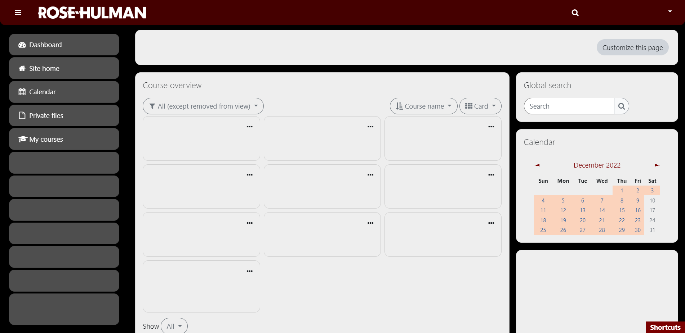

# Moodle Tweaks
CSS and JS files that add functionality to Moodle

Note: This code was designed for Rose-Hulman's Moodle site

## Getting Started
1. Download a code injector plugin for your browser. I'm using [Injector for Chrome](https://chrome.google.com/webstore/detail/injector/bfdonckegflhbiamlmidciapolfccmmb).
2. Create a new JS snippet for the website domain. Copy and paste the code from `moodle-main.js`.
3. Click save and reload your Moodle page.

## Features
### JavaScript
CleanSideMenu:
- Removes old courses from the sidebar. Click on "My courses" to set up

ModifyURL:
- Redirects to dashboard when on site home and course enrollment pages. Add `#bypass` to the end of the URL to avoid redirect.
- Removes forcedownload attributes from file links. Useful for images and PDFs.

AddButtons:
- Adds links to external sites at the top of the dashboard page

CourseSearch:
- Click the search button in the header or press `Ctrl+K` (Cmd+K) to open an updated search experience
- If something on the site isn't working, add `#bypass` to the end of the URL and try again

### CSS
A modern interface design with darker colors

Screenshots:

# Course Lookup
A modernized look for the RHIT course schedule lookup page

## Getting Started
1. Download a code injector plugin for your browser. I'm using [Injector for Chrome](https://chrome.google.com/webstore/detail/injector/bfdonckegflhbiamlmidciapolfccmmb).
2. Create a new JS snippet for the website domain. Copy and paste the code from `courselookup-main.js`.
3. Click save and open the course lookup page.

## Features
### JavaScript
CleanPrint:
- Press `Ctrl+P` (Cmd+P) to to show the page in print mode

### CSS
A modern interface design with darker colors